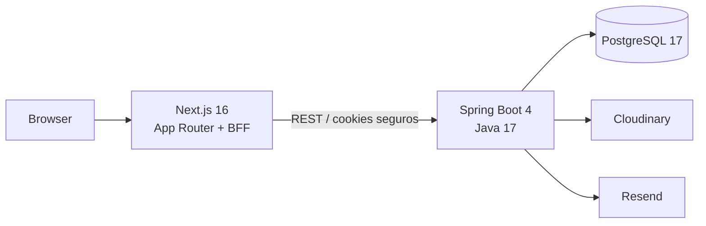
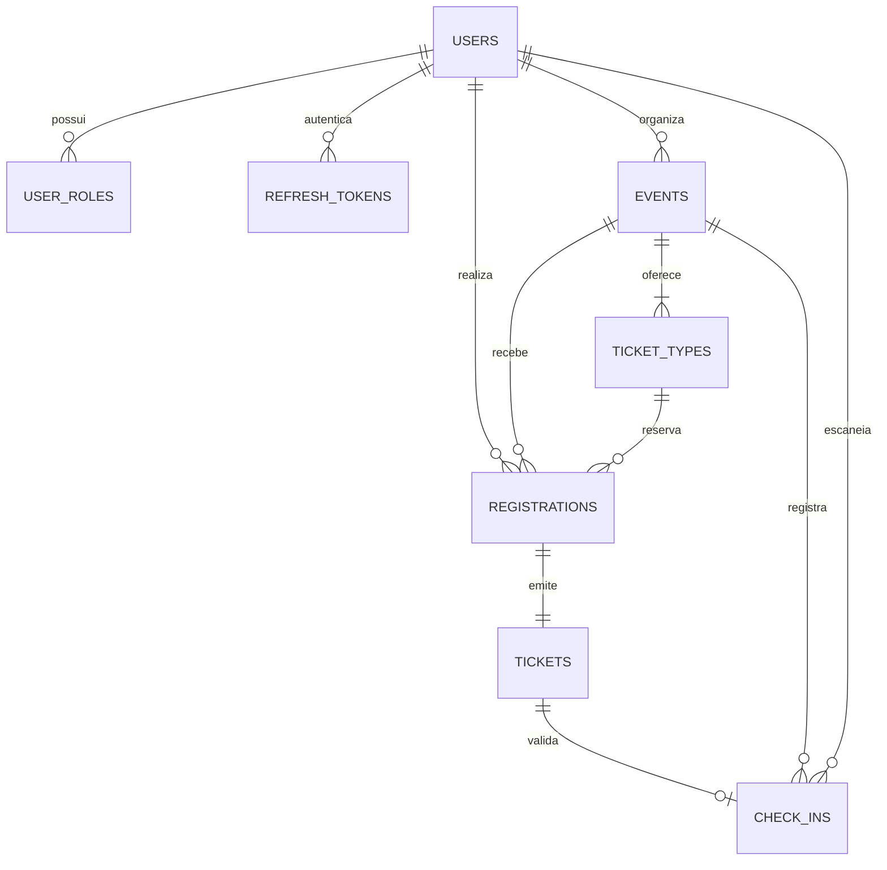

# EventHub

Plataforma full stack para publicar eventos gratuitos, controlar inscrições e validar ingressos com QR Code. O projeto foi construído como um monólito modular, com foco em segurança, concorrência e uma experiência mobile adequada para a operação na entrada do evento.


<details>
<summary>Ver catálogo mobile</summary>


</details>

## O que já está implementado

- Cadastro e login com perfis `USER`, `ORGANIZER` e `ADMIN`.
- Access token JWT RS256 curto e refresh token opaco, rotativo e persistido apenas como hash.
- BFF no Next.js com cookies `HttpOnly`, `Secure` em produção e `SameSite=Lax`.
- Criação, edição, publicação e cancelamento de eventos gratuitos.
- Catálogo público com busca, filtro por cidade/data e paginação.
- Upload direto e assinado de capas para o Cloudinary, com validação de 5 MB no navegador.
- Inscrição e cancelamento com reserva atômica de capacidade no PostgreSQL.
- Ingresso com código público e QR Code assinado, versionado e sem dados pessoais.
- Scanner mobile e check-in único protegido por restrição no banco.
- Dashboard do organizador com métricas, inscritos e gráfico de ocupação.
- Outbox transacional para entrega de e-mails pelo Resend, com tentativas e modo sandbox.
- Problem Details com códigos estáveis, Swagger/OpenAPI, Flyway, Docker Compose e CI.

## Arquitetura



O back-end é organizado por domínio em `auth`, `users`, `events`, `registrations`, `tickets`, `checkin`, `media`, `notifications` e `reporting`. O Spring Modulith verifica os limites entre esses módulos. O PostgreSQL é a única fonte de verdade; Redis e RabbitMQ foram intencionalmente deixados para uma evolução posterior.

No front-end, páginas públicas usam Server Components. Formulários, gráficos e scanner usam Client Components com TanStack Query, React Hook Form e Zod. Requisições autenticadas passam pelo BFF; nenhum token é exposto ao `localStorage`.

## Modelo de dados



As alterações de schema vivem exclusivamente em `backend/src/main/resources/db/migration`. O Hibernate usa `ddl-auto=validate` e nunca cria tabelas em produção.

## Concorrência: a última vaga

A reserva não faz a sequência insegura “consultar e depois incrementar”. A API executa uma única atualização condicional dentro da transação:

```sql
UPDATE ticket_types
SET confirmed_count = confirmed_count + 1
WHERE id = :id AND confirmed_count < capacity;
```

Somente quem obtém uma linha alterada continua. Inscrição, ingresso e mensagem da outbox são inseridos na mesma transação; qualquer falha reverte também o contador. Uma restrição única em `(event_id, participant_id)` bloqueia inscrições duplicadas.

O check-in segue o mesmo princípio: `INSERT ... ON CONFLICT DO NOTHING` sobre uma restrição única em `ticket_id`. Entre duas leituras simultâneas do mesmo QR, exatamente uma recebe `201 CHECKED_IN`; a outra recebe `409 ALREADY_CHECKED_IN` com o horário da primeira entrada.

## Stack

| Camada | Tecnologias |
| --- | --- |
| Web | Next.js 16, React 19, TypeScript, Tailwind CSS 4 |
| Estado e formulários | TanStack Query, React Hook Form, Zod |
| API | Spring Boot 4, Java 17, Spring Security, Spring Data JPA |
| Dados | PostgreSQL 17, Flyway, Hibernate |
| Integrações | Cloudinary, Resend, QR Code assinado |
| Qualidade | JUnit, Testcontainers, Vitest, Testing Library, Playwright, JaCoCo |
| Operação | Docker Compose, OpenAPI/Swagger, GitHub Actions |

## Executar com Docker

Pré-requisito: Docker Desktop com Docker Compose.

```bash
cp .env.example .env
docker compose up --build
```

Depois do health check do PostgreSQL:

- Aplicação: `http://localhost:3000`
- Swagger UI: `http://localhost:8080/swagger-ui.html`
- OpenAPI JSON: `http://localhost:8080/v3/api-docs`
- Health check: `http://localhost:8080/actuator/health`

O seed local cria um evento publicado e duas contas:

| Perfil | E-mail | Senha |
| --- | --- | --- |
| Organizador | `organizador@eventhub.dev` | `Demo@123` |
| Participante | `participante@eventhub.dev` | `Demo@123` |

Desative o seed em ambientes públicos com `DEMO_SEED=false`. Fora do Docker Compose, o seed já vem desativado.

## Executar para desenvolvimento

Com PostgreSQL disponível em `localhost:5432`, defina `JWT_ALLOW_EPHEMERAL=true` e um `QR_SIGNING_SECRET` de pelo menos 32 caracteres apenas no ambiente local:

```bash
cd backend
./mvnw spring-boot:run
```

Em outro terminal:

```bash
cd frontend
pnpm install
pnpm dev
```

Copie `frontend/.env.example` para `frontend/.env.local` quando precisar alterar a URL interna da API.

## Variáveis de ambiente

Use `.env.example` como referência. Em produção, configure obrigatoriamente:

- `DB_URL`, `DB_USERNAME` e `DB_PASSWORD`.
- `JWT_ISSUER`, `JWT_PRIVATE_KEY` e `JWT_PUBLIC_KEY` — chaves RSA em PEM.
- `QR_SIGNING_SECRET` — segredo aleatório com pelo menos 32 caracteres.
- `FRONTEND_URL` — origem pública do Next.js.
- `CLOUDINARY_CLOUD_NAME`, `CLOUDINARY_API_KEY` e `CLOUDINARY_API_SECRET`.
- `RESEND_API_KEY` e `RESEND_FROM_EMAIL` quando houver domínio verificado.

No Docker Compose local, `JWT_ALLOW_EPHEMERAL=true` gera chaves temporárias. Em produção, deixe essa opção desativada e configure o par RSA; também use `DEMO_SEED=false`.

Sem credenciais do Resend, a outbox continua funcional e o adaptador registra a entrega em modo sandbox. O ingresso permanece disponível em **Meus ingressos**.

## Testes e verificações

```bash
# Back-end, incluindo PostgreSQL real via Testcontainers
cd backend
./mvnw verify

# Front-end
cd frontend
pnpm lint
pnpm typecheck
pnpm test
pnpm build
pnpm exec playwright install chromium
pnpm test:e2e
```

Os testes do back-end cobrem a assinatura do QR, os limites do monólito modular, a disputa pela última vaga e dois check-ins simultâneos. O teste de integração é ignorado automaticamente somente quando não existe um daemon Docker disponível.

Com a API rodando, os contratos TypeScript podem ser atualizados diretamente do OpenAPI:

```bash
cd frontend
pnpm generate:api
```

O pipeline em `.github/workflows/ci.yml` executa lint, typecheck, testes e builds. Depois, sobe a aplicação completa com Docker Compose, verifica a geração de tipos a partir do OpenAPI e testa criação, publicação, inscrição, ingresso, check-in repetido e dashboard.

## Contrato de erros

Erros de negócio seguem `application/problem+json` e incluem um `code` estável. Exemplos:

- `EVENT_SOLD_OUT`
- `ALREADY_REGISTERED`
- `INVALID_TICKET`
- `ALREADY_CHECKED_IN`
- `FORBIDDEN`

Isso permite que o front-end traduza mensagens sem depender do texto retornado pela API.

## Publicar sem custo e sem cartão

O código está pronto para **Vercel Hobby + Render Free + Neon Free**. A publicação exige contas dos provedores; nenhum endereço de produção deve ser anunciado antes da validação da jornada completa. Não use o PostgreSQL gratuito da Render: ele expira após 30 dias.

1. Crie um projeto **PostgreSQL 17 no Neon**, região AWS `us-east-1` (Virgínia). Guarde host, database, usuário e senha no painel do provedor.
2. Importe este repositório como **Blueprint na Render** usando `render.yaml`. Ele seleciona apenas a instância `free`, na Virgínia, com Docker em `backend/`, health check `/actuator/health`, heap Java máximo de 256 MB e pool de duas conexões. Na criação, preencha `DB_URL` no formato `jdbc:postgresql://HOST/DATABASE?sslmode=require`, `DB_USERNAME`, `DB_PASSWORD`, `JWT_PRIVATE_KEY` e `JWT_PUBLIC_KEY`. Gere o par RS256 com `scripts/generate-jwt-keys.ps1` em um terminal privado e **nunca** o inclua no Git, no README ou em capturas de tela. O segredo do QR é gerado pela Render e precisa continuar estável entre redeploys.
3. Após a API estar saudável, importe o mesmo repositório na **Vercel** com `frontend` como Root Directory e configure `API_URL=https://SUA-API.onrender.com/api/v1` na Production Environment. Mantenha `COOKIE_SECURE` ausente, para que o modo de produção o ative. Não configure `NEXT_PUBLIC_API_URL` com segredos ou com um endereço interno.
4. Configure `FRONTEND_URL` na Render com a URL `https://...vercel.app` real e faça um redeploy. Para upload de capas, crie uma conta Cloudinary Free e configure `CLOUDINARY_CLOUD_NAME`, `CLOUDINARY_API_KEY` e `CLOUDINARY_API_SECRET` **somente na Render**. O browser recebe apenas uma assinatura curta para enviar diretamente a imagem.
5. Mantenha `RESEND_API_KEY` ausente: o worker confirma a outbox em modo sandbox, sem enviar e-mail. O ingresso continua disponível em **Meus ingressos**. Ative o Resend apenas depois de verificar um domínio remetente.

Depois de cada push em `main`, confira CI, deployment da Render e deployment da Vercel. Verifique `https://SUA-API.onrender.com/actuator/health`, `https://SUA-API.onrender.com/swagger-ui.html` e a página pública. A instância Render Free adormece após 15 minutos; o primeiro acesso pode levar cerca de um minuto. O catálogo espera até 90 segundos e, se a API não responder, exibe uma mensagem de indisponibilidade com nova tentativa automática, sem confundir falha com busca vazia. Evite serviços artificiais de ping para contornar os limites gratuitos.

Teste no endereço público: cadastro de organizador, publicação de evento com capa, cadastro de participante, inscrição, QR, primeiro check-in, rejeição do segundo check-in e dashboard. Confirme também HTTPS, layout mobile, cookies `HttpOnly`/`Secure` e ausência de segredos no Git. Se o processo Java não couber nos 512 MB gratuitos, interrompa o deploy e avalie outro plano somente com autorização explícita do proprietário.

## Próximas evoluções

Pagamentos, lista de espera, recuperação de senha, painel administrativo, múltiplos tipos de ingresso, Redis e RabbitMQ estão fora do MVP. Eles só devem entrar quando houver uma necessidade mensurável, preservando a simplicidade operacional do monólito modular.

