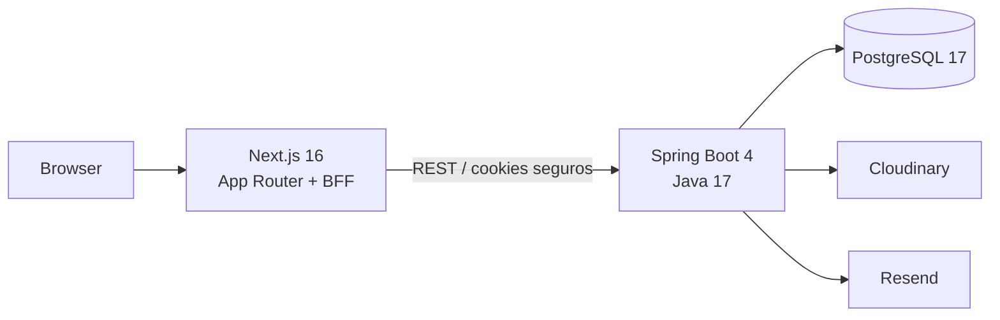
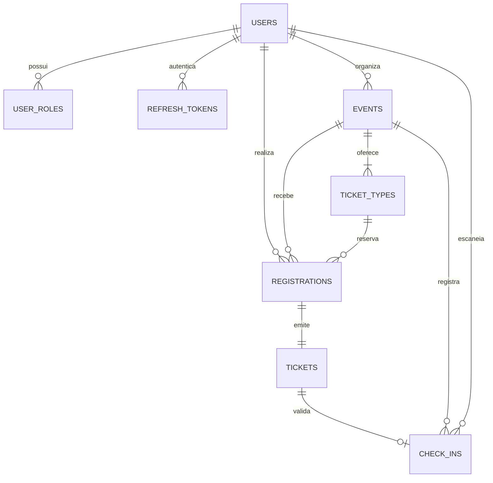

# EventHub

Plataforma full stack para publicar eventos gratuitos, controlar inscri��es e validar ingressos com QR Code. O projeto foi constru�do como um mon�lito modular, com foco em seguran�a, concorr�ncia e uma experi�ncia mobile adequada para a opera��o na entrada do evento.

**Online:** [abrir EventHub](https://eventhub-alpha-sandy.vercel.app) � [API e Swagger](https://eventhub-api-3c8f.onrender.com/swagger-ui.html) � [health check](https://eventhub-api-3c8f.onrender.com/actuator/health)

A demonstra��o p�blica utiliza Vercel Hobby, Render Free, Neon Free e Cloudinary Free. O envio de e-mails permanece em sandbox at� existir um dom�nio de remetente verificado. Crie sua pr�pria conta para experimentar; as credenciais de demonstra��o abaixo existem apenas no ambiente local com seed habilitado.


<details>
<summary>Ver cat�logo mobile</summary>


</details>

## O que j� est� implementado

- Cadastro e login com perfis `USER`, `ORGANIZER` e `ADMIN`.
- Access token JWT RS256 curto e refresh token opaco, rotativo e persistido apenas como hash.
- BFF no Next.js com cookies `HttpOnly`, `Secure` em produ��o e `SameSite=Lax`.
- Cria��o, edi��o, publica��o e cancelamento de eventos gratuitos.
- Cat�logo p�blico com busca, filtro por cidade/data e pagina��o.
- Upload direto e assinado de capas para o Cloudinary, com valida��o de 5 MB no navegador.
- Inscri��o e cancelamento com reserva at�mica de capacidade no PostgreSQL.
- Ingresso com c�digo p�blico e QR Code assinado, versionado e sem dados pessoais.
- Scanner mobile e check-in �nico protegido por restri��o no banco.
- Dashboard do organizador com m�tricas, inscritos e gr�fico de ocupa��o.
- Outbox transacional para entrega de e-mails pelo Resend, com tentativas e modo sandbox.
- Problem Details com c�digos est�veis, Swagger/OpenAPI, Flyway, Docker Compose e CI.

## Arquitetura



O back-end � organizado por dom�nio em `auth`, `users`, `events`, `registrations`, `tickets`, `checkin`, `media`, `notifications` e `reporting`. O Spring Modulith verifica os limites entre esses m�dulos. O PostgreSQL � a �nica fonte de verdade; Redis e RabbitMQ foram intencionalmente deixados para uma evolu��o posterior.

No front-end, p�ginas p�blicas usam Server Components. Formul�rios, gr�ficos e scanner usam Client Components com TanStack Query, React Hook Form e Zod. Requisi��es autenticadas passam pelo BFF; nenhum token � exposto ao `localStorage`.

## Modelo de dados



As altera��es de schema vivem exclusivamente em `backend/src/main/resources/db/migration`. O Hibernate usa `ddl-auto=validate` e nunca cria tabelas em produ��o.

## Concorr�ncia: a �ltima vaga

A reserva n�o faz a sequ�ncia insegura "consultar e depois incrementar". A API executa uma �nica atualiza��o condicional dentro da transa��o:

```sql
UPDATE ticket_types
SET confirmed_count = confirmed_count + 1
WHERE id = :id AND confirmed_count < capacity;
```

Somente quem obt�m uma linha alterada continua. Inscri��o, ingresso e mensagem da outbox s�o inseridos na mesma transa��o; qualquer falha reverte tamb�m o contador. Uma restri��o �nica em `(event_id, participant_id)` bloqueia inscri��es duplicadas.

O check-in segue o mesmo princ�pio: `INSERT ... ON CONFLICT DO NOTHING` sobre uma restri��o �nica em `ticket_id`. Entre duas leituras simult�neas do mesmo QR, exatamente uma recebe `201 CHECKED_IN`; a outra recebe `409 ALREADY_CHECKED_IN` com o hor�rio da primeira entrada.

## Stack

| Camada | Tecnologias |
| --- | --- |
| Web | Next.js 16, React 19, TypeScript, Tailwind CSS 4 |
| Estado e formul�rios | TanStack Query, React Hook Form, Zod |
| API | Spring Boot 4, Java 17, Spring Security, Spring Data JPA |
| Dados | PostgreSQL 17, Flyway, Hibernate |
| Integra��es | Cloudinary, Resend, QR Code assinado |
| Qualidade | JUnit, Testcontainers, Vitest, Testing Library, Playwright, JaCoCo |
| Opera��o | Docker Compose, OpenAPI/Swagger, GitHub Actions |

## Executar com Docker

Pr�-requisito: Docker Desktop com Docker Compose.

```bash
cp .env.example .env
docker compose up --build
```

Depois do health check do PostgreSQL:

- Aplica��o: `http://localhost:3000`
- Swagger UI: `http://localhost:8080/swagger-ui.html`
- OpenAPI JSON: `http://localhost:8080/v3/api-docs`
- Health check: `http://localhost:8080/actuator/health`

O seed local cria um evento publicado e duas contas:

| Perfil | E-mail | Senha |
| --- | --- | --- |
| Organizador | `organizador@eventhub.dev` | `Demo@123` |
| Participante | `participante@eventhub.dev` | `Demo@123` |

Desative o seed em ambientes p�blicos com `DEMO_SEED=false`. Fora do Docker Compose, o seed j� vem desativado.

## Executar para desenvolvimento

Com PostgreSQL dispon�vel em `localhost:5432`, defina `JWT_ALLOW_EPHEMERAL=true` e um `QR_SIGNING_SECRET` de pelo menos 32 caracteres apenas no ambiente local:

```bash
cd backend
./mvnw spring-boot:run
```

Em outro terminal:

```bash
cd frontend
pnpm install
pnpm dev
```

Copie `frontend/.env.example` para `frontend/.env.local` quando precisar alterar a URL interna da API.

## Vari�veis de ambiente

Use `.env.example` como refer�ncia. Em produ��o, configure obrigatoriamente:

- `DB_URL`, `DB_USERNAME` e `DB_PASSWORD`.
- `JWT_ISSUER`, `JWT_PRIVATE_KEY` e `JWT_PUBLIC_KEY` - chaves RSA em PEM.
- `QR_SIGNING_SECRET` - segredo aleat�rio com pelo menos 32 caracteres.
- `FRONTEND_URL` - origem p�blica do Next.js.
- `CLOUDINARY_CLOUD_NAME`, `CLOUDINARY_API_KEY` e `CLOUDINARY_API_SECRET`.
- `RESEND_API_KEY` e `RESEND_FROM_EMAIL` quando houver dom�nio verificado.

No Docker Compose local, `JWT_ALLOW_EPHEMERAL=true` gera chaves tempor�rias. Em produ��o, deixe essa op��o desativada e configure o par RSA; tamb�m use `DEMO_SEED=false`.

Sem credenciais do Resend, a outbox continua funcional e o adaptador registra a entrega em modo sandbox. O ingresso permanece dispon�vel em **Meus ingressos**.

## Testes e verifica��es

```bash
# Back-end, incluindo PostgreSQL real via Testcontainers
cd backend
./mvnw verify

# Front-end
cd frontend
pnpm lint
pnpm typecheck
pnpm test
pnpm build
pnpm exec playwright install chromium
pnpm test:e2e
```

Os testes do back-end cobrem a assinatura do QR, os limites do mon�lito modular, a disputa pela �ltima vaga e dois check-ins simult�neos. O teste de integra��o � ignorado automaticamente somente quando n�o existe um daemon Docker dispon�vel.

Com a API rodando, os contratos TypeScript podem ser atualizados diretamente do OpenAPI:

```bash
cd frontend
pnpm generate:api
```

O pipeline em `.github/workflows/ci.yml` executa lint, typecheck, testes e builds. Depois, sobe a aplica��o completa com Docker Compose, verifica a gera��o de tipos a partir do OpenAPI e testa cria��o, publica��o, inscri��o, ingresso, check-in repetido e dashboard.

## Contrato de erros

Erros de neg�cio seguem `application/problem+json` e incluem um `code` est�vel. Exemplos:

- `EVENT_SOLD_OUT`
- `ALREADY_REGISTERED`
- `INVALID_TICKET`
- `ALREADY_CHECKED_IN`
- `FORBIDDEN`

Isso permite que o front-end traduza mensagens sem depender do texto retornado pela API.

## Publicar sem custo e sem cart�o

Esta inst�ncia est� publicada em **Vercel Hobby + Render Free + Neon Free**. N�o use o PostgreSQL gratuito da Render: ele expira ap�s 30 dias. Para reproduzir a publica��o em contas pr�prias:

1. Crie um projeto **PostgreSQL 17 no Neon**, regi�o AWS `us-east-1` (Virg�nia). Guarde host, database, usu�rio e senha no painel do provedor.
2. Importe este reposit�rio como **Blueprint na Render** usando `render.yaml`. Ele seleciona apenas a inst�ncia `free`, na Virg�nia, com Docker em `backend/`, health check `/actuator/health`, heap Java m�ximo de 256 MB e pool de duas conex�es. Na cria��o, preencha `DB_URL` no formato `jdbc:postgresql://HOST/DATABASE?sslmode=require`, `DB_USERNAME`, `DB_PASSWORD`, `JWT_PRIVATE_KEY` e `JWT_PUBLIC_KEY`. Gere o par RS256 com `scripts/generate-jwt-keys.ps1` em um terminal privado e **nunca** o inclua no Git, no README ou em capturas de tela. O segredo do QR � gerado pela Render e precisa continuar est�vel entre redeploys.
3. Ap�s a API estar saud�vel, importe o mesmo reposit�rio na **Vercel** com `frontend` como Root Directory e configure `API_URL=https://SUA-API.onrender.com/api/v1` na Production Environment. Mantenha `COOKIE_SECURE` ausente, para que o modo de produ��o o ative. N�o configure `NEXT_PUBLIC_API_URL` com segredos ou com um endere�o interno.
4. Configure `FRONTEND_URL` na Render com a URL `https://...vercel.app` real e fa�a um redeploy. Para upload de capas, crie uma conta Cloudinary Free e configure `CLOUDINARY_CLOUD_NAME`, `CLOUDINARY_API_KEY` e `CLOUDINARY_API_SECRET` **somente na Render**. O browser recebe apenas uma assinatura curta para enviar diretamente a imagem.
5. Mantenha `RESEND_API_KEY` ausente: o worker confirma a outbox em modo sandbox, sem enviar e-mail. O ingresso continua dispon�vel em **Meus ingressos**. Ative o Resend apenas depois de verificar um dom�nio remetente.

Depois de cada push em `main`, confira CI e os deployments da Render e da Vercel. Para redeploy manual, abra o servi�o `eventhub-api` na Render e use **Manual Deploy**; na Vercel, abra o projeto `eventhub`, selecione o �ltimo deployment e use **Redeploy**. Verifique o [health check](https://eventhub-api-3c8f.onrender.com/actuator/health), o [Swagger](https://eventhub-api-3c8f.onrender.com/swagger-ui.html) e a [p�gina p�blica](https://eventhub-alpha-sandy.vercel.app). A inst�ncia Render Free adormece ap�s 15 minutos; o primeiro acesso pode levar v�rios minutos (205 segundos na verifica��o de 01/10/2026). O cat�logo espera at� 20 segundos por tentativa e, se a API n�o responder, exibe uma mensagem de servi�o iniciando com nova tentativa autom�tica a cada 15 segundos, sem confundir falha com busca vazia. Evite servi�os artificiais de ping para contornar os limites gratuitos.

Teste no endere�o p�blico: cadastro de organizador, publica��o de evento com capa, cadastro de participante, inscri��o, QR, primeiro check-in, rejei��o do segundo check-in e dashboard. Confirme tamb�m HTTPS, layout mobile, cookies `HttpOnly`/`Secure` e aus�ncia de segredos no Git. Se o processo Java n�o couber nos 512 MB gratuitos, interrompa o deploy e avalie outro plano somente com autoriza��o expl�cita do propriet�rio.

## Pr�ximas evolu��es

Pagamentos, lista de espera, recupera��o de senha, painel administrativo, m�ltiplos tipos de ingresso, Redis e RabbitMQ est�o fora do MVP. Eles s� devem entrar quando houver uma necessidade mensur�vel, preservando a simplicidade operacional do mon�lito modular.

